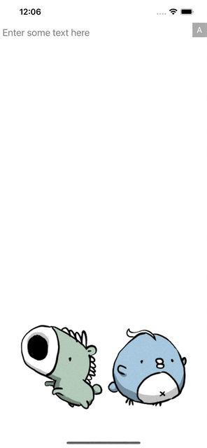

### GoogleFontBrowser

This project implements the Google Font picker. To get started locally, pull the repository and run:
```sh
pod install
```

And you can open `PicCollageTakeHomeQuiz.xcworkspace` with your Xcode to build and run.

